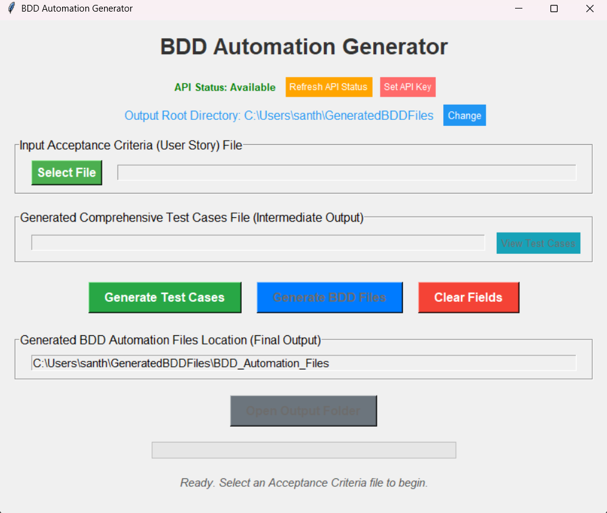

# BDD Automation Generator

A Python application that generates BDD (Behavior Driven Development) automation files from user stories using Google's Gemini AI. This tool automates the creation of comprehensive test cases, feature files, step definitions, and page objects from user story descriptions.

## Application Preview



*If the image above doesn't display, you can see the application interface [here](images/application_preview.png)*

The BDD Automation Generator provides a user-friendly interface that allows you to:
- Select input user story files (Excel format)
- Generate comprehensive test cases for each user story
- Create BDD automation files in multiple programming languages
- Configure output locations for generated files
- Easily view and manage generated artifacts

## Features

- **Comprehensive Test Case Generation**: Creates detailed test cases from user stories with both positive and negative scenarios
- **Multi-language Support**: Generates automation code in JavaScript, Java, and Python
- **AI-Powered**: Leverages Google Gemini API for intelligent code generation
- **Cross-platform**: Works on Windows, macOS, and Linux
- **Easy to Use**: Simple GUI interface for file selection and generation
- **Complete BDD Framework**: Generates feature files, step definitions, page objects, and configuration files

## Setup

1. Install dependencies:
   ```
   pip install -r requirements.txt
   ```

2. Set up a Gemini API key as an environment variable:
   ```
   GEMINI_API_KEY=your_api_key_here
   ```

3. Run the application:
   ```
   python bdd_generator.py
   ```

## Distribution

The project includes:

- **Root Folder**: Contains the main application (`bdd_generator.py`), requirements, and documentation
- **BDD_Automation_Generator_Distribution/**: Contains distribution files with launch scripts
- **BDD_Automation_Generator_Portable/**: Contains a standalone executable version

## Requirements

- Python 3.8+
- Dependencies listed in requirements.txt

## How It Works

1. **Input**: Excel file containing user stories with acceptance criteria
2. **Phase 1**: The application generates comprehensive test cases for each user story
3. **Phase 2**: BDD automation files are created based on the test cases
4. **Output**: Feature files, step definitions, and page objects in multiple programming languages

## Generated Output

The application produces the following outputs:

1. **Comprehensive Test Cases File** (Intermediate Output):
   - Excel file containing detailed test cases with positive and negative scenarios
   - Each test case includes step actions and expected results
   - Login steps and verification steps for each scenario

2. **BDD Automation Files** (Final Output):
   - **Feature Files**: Contains Gherkin scenarios for all test cases
   - **JavaScript Implementation**: Step definitions, page objects, and package.json
   - **Java Implementation**: Step definitions, page objects, and pom.xml
   - **Python Implementation**: Step definitions, page objects, and requirements.txt

The generated files provide a complete foundation for BDD automation frameworks that can be directly used with Cucumber/Behave and Selenium.

## Directory Structure

```
├── bdd_generator.py          # Main application
├── requirements.txt          # Python dependencies
├── README.md                 # This file
├── version_info.txt          # Version information
├── BDD_Automation_Generator_Distribution/
│   ├── Launch_BDD_Generator.bat      # Windows launcher
│   ├── launch_bdd_generator.sh       # Linux/Mac launcher
│   ├── requirements.txt              # Python dependencies
│   └── README.md                     # Distribution documentation
└── BDD_Automation_Generator_Portable/
    ├── BDD_Automation_Generator.exe  # Standalone Windows executable
    ├── Launch.bat                    # Windows launcher
    ├── requirements.txt              # Python dependencies
    └── README.md                     # Portable documentation
```

## License

MIT License - Feel free to use, modify and distribute as needed.
